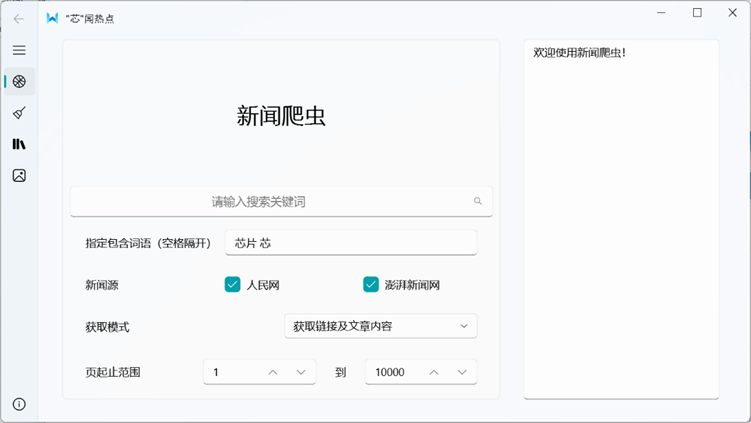
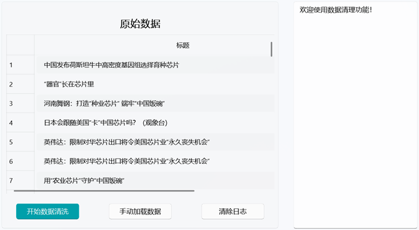
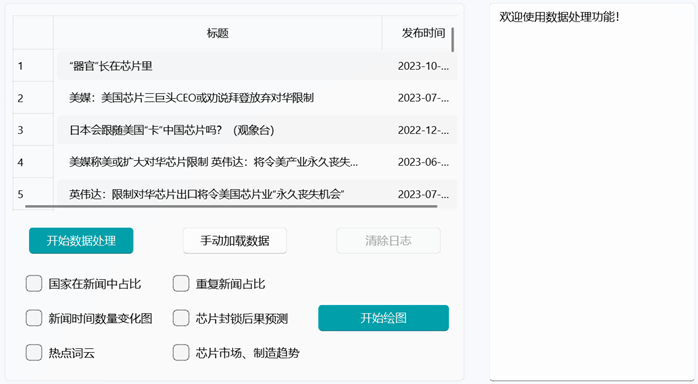
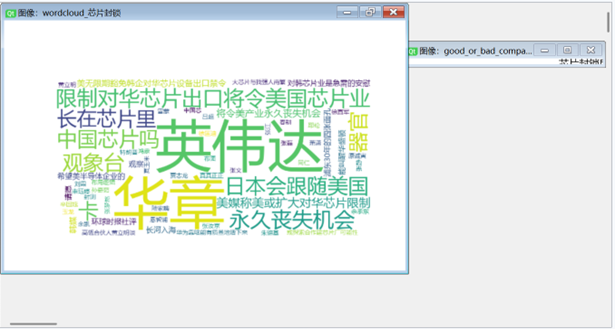

# “芯”闻热点

完成于2023/11/14，不要问我为什么现在才传（

这里也记录一下嘿嘿

与`dj`合作完成

# 新闻爬虫

1) 根据用户输入的与芯片相关的关键词，爬取不同新闻源的相关网页，从中提取出新闻地址。
2) 根据提取出的新闻地址，爬取新闻内容。
3) 对爬取的新闻内容进行处理，提取出标题、作者、编辑、来源、发布时间、正文等内容。
4) 将提取的新闻地址及新闻内容保存到文件中。
5) 支持断点续爬，即因网络波动等导致爬取中断后，可以从指定地址继续爬取。

# 数据清洗

1) 根据爬取的原始新闻数据进行重复网页统计，并去除重复部分。
2) 将去重后的新闻数据保存到文件中，并统计。

# 数据处理

1) 从新闻数据中抽取摘要、国家、人物和关键词信息，提取重大事件、重要人物等。
2) 将上述提取的数据进行合并，保存到文件中。

# 图像结果

1) 从爬取到的信息，绘出新闻数量随时间变化的折线图。
2) 分析“芯片封锁”的时间线和后果，绘出堆叠柱状图。
3) 分析“芯片封锁”中出现的热点事件、热点人物，绘出词云图。
4) 分析爬取新闻中提及的国家，绘出饼图。
5) 分析“芯片制造和市场”的格局和走势变化，预测芯片市场的趋势，并绘出拟合曲线图。
6) 根据数据清洗得到的数据，绘出重复数据占比饼图。

